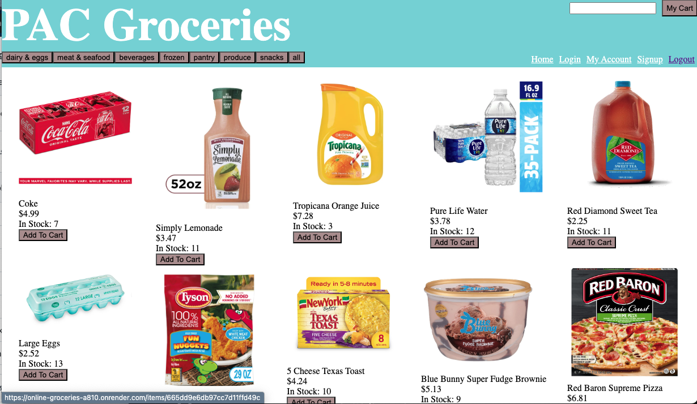
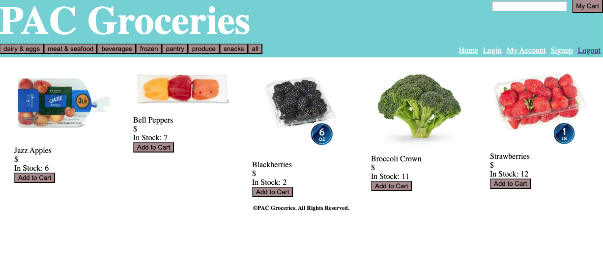
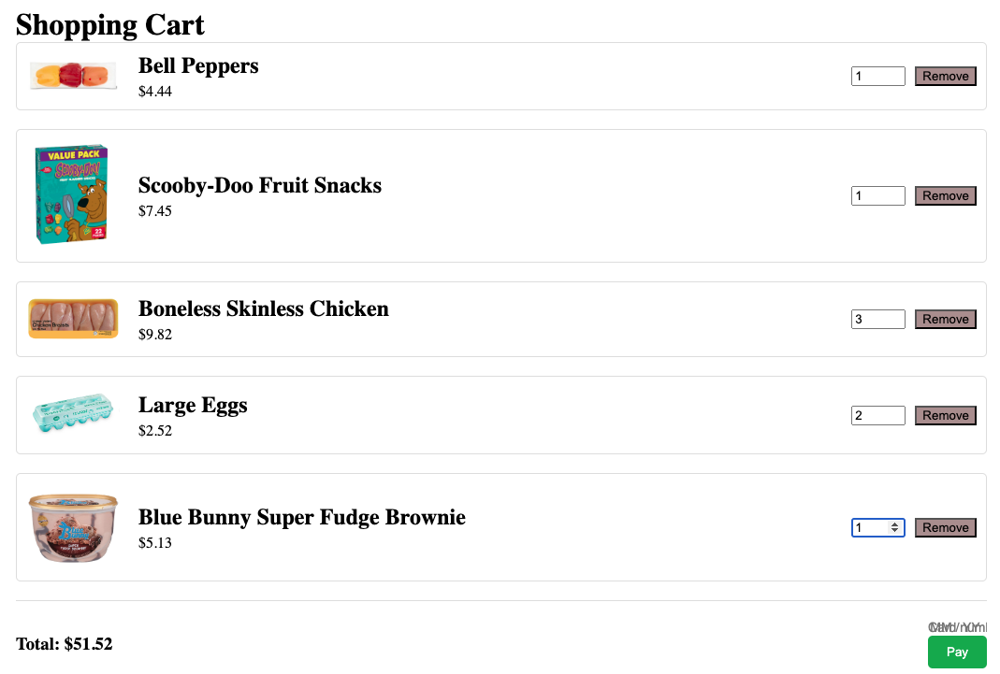

# online-groceries 

  In this application, a user will be able to shop stress free for their groceries. It allows the user to search for groceries they may want, or the user can go through the different departments and leisurely scroll through different food items to add to their cart. In the cart, the user will be able to edit it and remove items. Once the grocery shopping is completed, the user will be able to pay for their groceries online without worry of having to go in to the store.

  ## Table of Contents
  1. [Installation](#installation)
  2. [usage](#usageinfo)
  3. [license](#licenses)
  4. [Contributors](#contribution)
  5. [Tests](#testing)

  ## Installation
  All packages already installed in Render deployed website.

  ## Usage
  Here is a link to the deployed page on Render: ![https://online-groceries-a810.onrender.com/]

  
  
  
  

  ## License
  MIT

  ## Contributors
  Courtney Hook, Student
  Anna Jantzen, Student
  Patrick Bowen, Student
  Chris Baird, Tutor
  Ian Von Fange, TA
  

  ## Tests
  N/A
